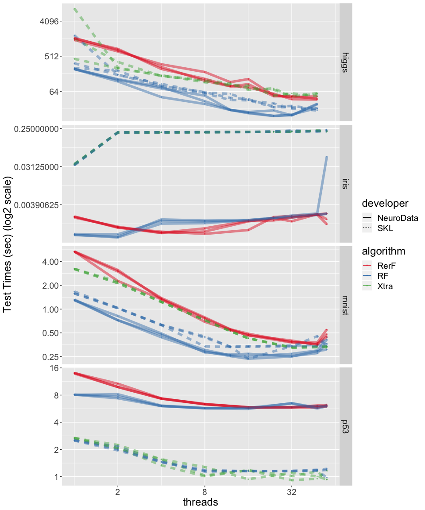
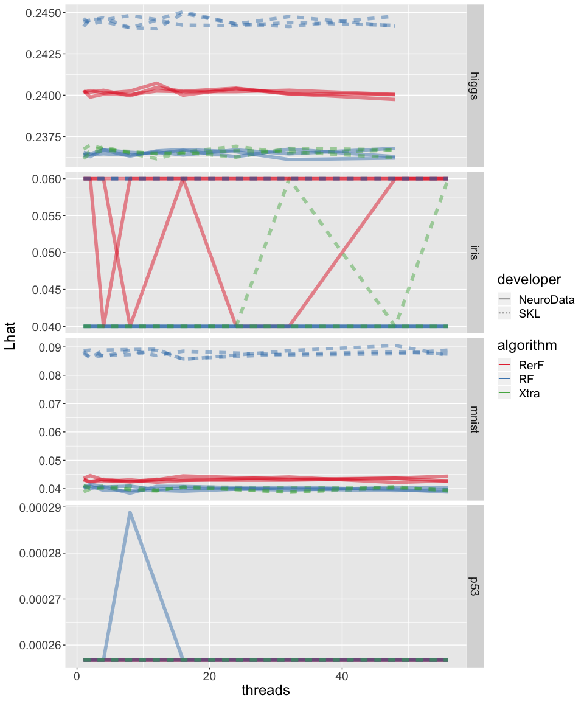

Testing Times on Iris, MNIST, HIGGS, and p53
============================================

.. code:: r

   require(data.table)
   require(RColorBrewer)
   require(gridExtra)
   require(ggplot2)
   require(reshape2)

   tmp <- strsplit(as.character(packageVersion('rerf')), "[.]")[[1]]
   tmp <- lapply(tmp, as.numeric)
   if(any(tmp < c(2, 0, 4, 9007))){
       stop("rerf version does not contain binnedBaseTern fixes.")
   }

.. code:: python

   import pandas as pd
   import time, multiprocessing
   import numpy as np
   import rerf
   from rerf.RerF import fastPredict, fastPredictPost, fastRerF
   from rerf.rerfClassifier import rerfClassifier

   import numpy as np
   import matplotlib.pyplot as plt
   from matplotlib.colors import ListedColormap

   from sklearn import datasets
   from sklearn.ensemble import ExtraTreesClassifier
   from sklearn.ensemble import RandomForestClassifier, AdaBoostClassifier
   from sklearn.model_selection import train_test_split

   ##%%
   def loadData(name):
       if name == "iris":
           print('loading ' + name)
           iris = datasets.load_iris()
           rng = check_random_state(0)
           perm = rng.permutation(iris.target.size)
           iris.data = iris.data[perm]
           iris.target = iris.target[perm]

           Xtrain = iris.data[0:100, :]
           Ytrain = iris.target[0:100]
           Xtest = iris.data[100::, :]
           Ytest = iris.target[100::]
           print("DONE")

       if name == "mnist":
           print('loading ' + name)
           Xtrain = pd.read_csv("./mnist-in-csv/mnist_train.csv", dtype = np.int8)
           Ytrain = Xtrain['label']
           Xtrain = Xtrain.drop(['label'], axis=1)

           Xtest = pd.read_csv("./mnist-in-csv/mnist_test.csv", dtype = np.int8)
           Ytest = Xtest['label']
           Xtest = Xtest.drop(['label'], axis=1)
           print("DONE")

       if name == "higgs":
           print('loading ' + name)
           Xtrain = pd.read_csv("HIGGS.csv", nrows = (11000000 - 500000), header = None)
           Ytrain = np.int8(Xtrain[0])
           Xtrain = np.asarray(Xtrain.drop([0], axis = 1))
           

           Xtest = pd.read_csv("HIGGS.csv", skiprows =  (11000000 - 500000), header = None)
           Ytest = np.int8(Xtest[0])
           Xtest = np.asarray(Xtest.drop([0], axis=1))
           print("DONE")

       if name == "p53":
           print('loading ' + name)
           Xtrain = pd.read_csv("p53_old_2010/K8.nocomma.data", header = None, na_values = "?")
           Xtrain = Xtrain.dropna(axis=0)

           Ytrain = np.asarray([{'inactive':0, 'active':1}[i] for i in Xtrain[5408]])
           Xtrain = np.asarray(Xtrain.drop([5408], axis = 1))

           Xtest = pd.read_csv("p53_new_Data Sets/K9.nocomma.data", header = None, na_values = "?")
           Xtest = Xtest.dropna(axis=0)

           Ytest = np.asarray([{'inactive':0, 'active':1}[i] for i in Xtest[5408]])
           Xtest = np.asarray(Xtest.drop([5408], axis=1))
           print("DONE")

       return Xtrain, Ytrain, Xtest, Ytest

   ##%%
   def run(datasetName, pythonFile, numTrees, NCPU, nruns):
       X, Y, Xtest, Ytest = loadData(datasetName)
       for ncpu in NCPU:
           for iterate in range(1, nruns + 1):
               ## {Name: {cl: , color:}}
               classifiers = {
                       "Sk-RF": {"cl":RandomForestClassifier(n_estimators=int(numTrees), max_depth = None, n_jobs = int(ncpu)),
                           "color": "blue"},
                       "Sk-Xtra": {"cl": ExtraTreesClassifier(n_estimators = int(numTrees), max_depth = None, n_jobs = int(ncpu)),
                           "color": "purple"},
                       "ND-pyRF": {"cl": rerfClassifier(n_estimators = int(numTrees), 
                           projection_matrix = "Base", max_depth = None, n_jobs = int(ncpu)), 
                           "color": "red"},
                       "ND-pyRerF" : {"cl": rerfClassifier(n_estimators = int(numTrees), 
                           projection_matrix = "RerF", max_depth = None, n_jobs = int(ncpu)), 
                           "color": "pink"},
                           }
               for key in classifiers:
                   with open(pythonFile, 'a') as f:
                       clf = classifiers[key]['cl']
               
                       trainStartTime = time.time()
                       clf.fit(X, Y)
                       trainEndTime = time.time()
                                                                                                                  
                       trainTime = trainEndTime - trainStartTime
                                                                                                                  
                       testStartTime = time.time()
                       out = clf.predict(Xtest)
                       testEndTime = time.time()
                                                                                                                  
                       testTime = testEndTime - testStartTime
                                                                                                                  
                       lhat = np.mean(out != Ytest)
                       f.write(f"{key}, {datasetName}, {ncpu}, {lhat:2.9f}, {trainTime:2.9f}, {testTime:2.9f}, {iterate}\n")
               

       
       
       

   if __name__ == "__main__":
       NTREES = 500
       NCPU = [1, 2, 4, 8, 16, 24, 32, 48, 56]
       NCPU.reverse()

       NRUNS = 3
       
       names = ['iris', 'mnist', 'higgs', 'p53']

       for ni in names:
           pythonFile = "testing_times_python_" + ni + ".csv"
           
           with open(pythonFile, 'w+') as f:
               f.write("classifier, dataset, threads, Lhat,trainTime, testTime, iterate\n")
           
           run(ni, pythonFile, NTREES, NCPU, NRUNS)

Read in measurements and plot (in R)
------------------------------------

.. code:: r

   dA <- fread("testing_times_DATA.csv")
   dA$classifier <- factor(dA$classifier, levels = c("ND-pyRerF", "ND-pyRF", "Sk-Xtra", "Sk-RF"))

   dA$dataset <- factor(dA$dataset, levels = c("higgs","iris", "mnist", "p53"))
   dA$algorithm <- factor(c("RerF", "RF", "RF", "Xtra")[as.numeric(dA$classifier)])
   dA$developer <- factor(c("NeuroData", "NeuroData", "SKL", "SKL")[as.numeric(dA$classifier)])

   lineSize <- c(rep(1,3), 1)
   lineAlpha <- c(rep(0.45, 3), 0.2)

   ex <- scale_colour_brewer(type = 'qual', palette = "Set1") 
   th <- theme(legend.text=element_text(size = 14), legend.title = element_text(size = 16),
               plot.title = element_text(size = 12),
               strip.text.y = element_text(size = 14))

   th <- theme(text = element_text(size = 18))

.. code:: r

   p01 <- ggplot(data = dA, aes(x = threads, y = testTime, 
                               group = interaction(classifier, iterate, dataset), color = algorithm, linetype = developer)) +
           geom_point(alpha = 0.4, size = 0.5) + 
           geom_line(alpha = lineAlpha[dA$iterate], size = lineSize[dA$iterate]) + ex 

   p01 <- p01 + facet_grid(dataset ~ ., scales = "free") + scale_x_continuous(trans = scales::log2_trans()) 

   p1 <- p01 + scale_y_continuous(trans = scales::log2_trans())

   #p01 + ylab("Test Times (sec)") + th
   p1 + ylab("Test Times (sec) (log2 scale)") + th

|image0|\ 

.. code:: r

   p02 <- ggplot(data = dA, aes(x = threads, y = trainTime, 
                               group = interaction(classifier, iterate, dataset), color = algorithm, linetype = developer)) +
           geom_point(alpha = 0.4, size = 0.5) + 
           geom_line(alpha = lineAlpha[dA$iterate], size = lineSize[dA$iterate]) + ex 

   p02 <- p02 + facet_grid(dataset ~ ., scales = "free_y")

   p2 <- p02 + scale_y_continuous(trans = scales::log2_trans())
       
   p2 <- p2 + facet_grid(dataset ~ ., scales = "free_y")

   p2 + ylab("trainTimes (log2 scale)") + th

|image1|\ 

.. code:: r

   p03 <- ggplot(data = dA, aes(x = threads, y = Lhat, 
                               group = interaction(classifier, iterate, dataset), color = algorithm, linetype = developer)) +
           geom_line(alpha = lineAlpha[dA$iterate], size = lineSize[dA$iterate]) + ex 

   p03 <- p03 + facet_grid(dataset ~ ., scales = "free")
   p03 + th

|image2|\ 

.. |image1| image:: testing_times_files/figure-commonmark/testing-times-trainTime-1.png

