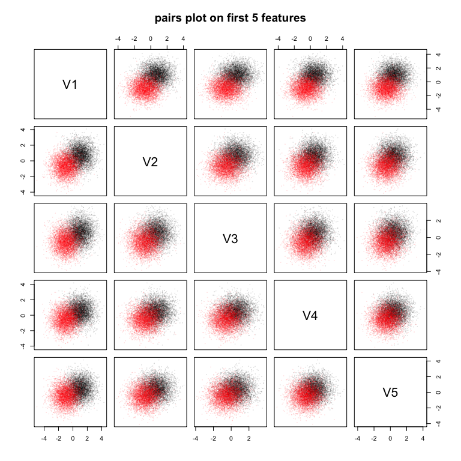

[Download the notebook
here](https://raw.githubusercontent.com/neurodata/RerF/staging/docs/demos/python_R_compare.Rmd)

``` r
ncpu <- parallel::detectCores()
NT <- 500L ## Number of trees
MC <- 5L ## MonteCarlo Iterations
```

``` r
require(data.table)
require(rerf)
require(RColorBrewer)
require(gridExtra)
require(ggplot2)
require(reshape2)
require(mvtnorm)
require(ranger)
require(Rborist)


#if(require(slackr)){
#    slackr_setup(config_file = '~/mrÆ/slackR/NeuroData/slackr.conf')
#    Sys.getenv("SLACK_CHANNEL")
#    qplot(mpg, wt, data=mtcars)
#
#    #dev.slackr(channels = "#standup")
#    #delete_slackr(count = 1)
#}
```

## Trunk’s Example: The Curse of Dimensionality

Consider the two-class classification problem as explained by Trunk in
his 1979 PAMI paper.

### Goal:

  - Using Trunk’s example dataset with `p = 1000` and `n = (10,
    ..., 10k)` compare our `RF` and `RerF` implementations in R and
    Python to `ranger`, `Rborist` in R and scikit-learn’s `RF` and
    `Extremely RF` implementations.

#### Generate Data

``` r
#### parameters
p <- 1000
k <- 4:13
n <- c(10, 2^k, 10000)

cn <- n / 2
ind <- lapply(cn, function(x) c(1:(x), (5001):(5001 + x - 1)))

#### labels
Y <- rep(c(0,1), each = rev(n)[1] / 2)

#### means
mu <- sapply(1:p, function(x) sqrt(1 / x))
mu1 <-  mu
mu2 <- -mu
```

``` r
#### Training Data
set.seed(317)
X1train <- rmvnorm(rev(n)[1]/2, mean = mu1, sigma = diag(length(mu1)))
X2train <- rmvnorm(rev(n)[1]/2, mean = mu2, sigma = diag(length(mu1)))

Ztrain <- cbind(Y, rbind(X1train, X2train))
colnames(Ztrain) <- c("Y", paste0("V", 1:1e3))
##write.csv(Ztrain, file = "train_trunk.csv", row.names = FALSE)

#### Testing Data
set.seed(2^13)
X1test <- rmvnorm(rev(n)[1]/2, mean = mu1, sigma = diag(length(mu1)))
X2test <- rmvnorm(rev(n)[1]/2, mean = mu2, sigma = diag(length(mu1)))

Ztest <- cbind(Y, rbind(X1test, X2test))
colnames(Ztest) <- c("Y", paste0("V", 1:1e3))
##write.csv(Ztest, file = "test_trunk.csv", row.names = FALSE)

trainFull <- data.table(Ztrain)
trainFull$Y <- as.factor(trainFull$Y)

testFull <- as.matrix(Ztest)[, -1]
testY <- as.factor(Ztest[, 1])
```

#### Look at it

``` r
pairs(Ztrain[, 2:6], col = scales::alpha(Ztrain[, 1] + 1, 0.1), cex = 0.1, pch = 19, main = "pairs plot on first 5 features")
```

<!-- -->

### Python and R runs

#### Python

Load and setup required libraries and data.

``` python
##%%
import pandas
import time, multiprocessing
import numpy as np
import rerf
from rerf.RerF import fastPredict, fastPredictPost, fastRerF
from rerf.rerfClassifier import rerfClassifier
from sklearn.ensemble import ExtraTreesClassifier
from sklearn.ensemble import RandomForestClassifier, AdaBoostClassifier
import numpy as np
import matplotlib.pyplot as plt
from matplotlib.colors import ListedColormap
from sklearn.model_selection import train_test_split
from sklearn.preprocessing import StandardScaler
from sklearn.datasets import make_moons, make_circles, make_classification
from sklearn.neural_network import MLPClassifier
from sklearn.neighbors import KNeighborsClassifier
from sklearn.svm import SVC
from sklearn.gaussian_process import GaussianProcessClassifier
from sklearn.gaussian_process.kernels import RBF
from sklearn.tree import DecisionTreeClassifier
from sklearn.ensemble import ExtraTreesClassifier
from sklearn.ensemble import RandomForestClassifier, AdaBoostClassifier
from sklearn.naive_bayes import GaussianNB
from sklearn.discriminant_analysis import QuadraticDiscriminantAnalysis
##%%
ncpu = r.ncpu
n = [10] + [2**k for k in range(4,14)] + [10000]
cn = [int(ni / 2) for ni in n]
names = ["skl-RF","skl-Xtra", "ND-Py-RF", "ND-Py-RerF"]
classifiers = [
    RandomForestClassifier(n_estimators=int(r.NT), max_depth = None, n_jobs = int(r.ncpu)),
    ExtraTreesClassifier(n_estimators = int(r.NT), max_depth = None, n_jobs = int(r.ncpu)),
    rerfClassifier(n_estimators = int(r.NT), projection_matrix = "Base", max_depth = None, n_jobs = int(r.ncpu)),
    rerfClassifier(n_estimators = int(r.NT), projection_matrix = "RerF", max_depth = None, n_jobs = int(r.ncpu))]
ind1 = [list(range(ni)) for ni in cn]
ind2 = [list(range(5000, 5000 + ni)) for ni in cn]
ind = [ind1i + ind2i for ind1i, ind2i in zip(ind1, ind2)]
Xtrain = np.asarray(r.Ztrain)[:, 1::]
Xtest = np.asarray(r.Ztest)[:, 1::]
Ytrain = np.asarray(r.Ztrain)[:, 0]
Ytest = np.asarray(r.Ztest)[:, 0]
#### Prep output file:
f = open('python_runs.csv', 'w+')
f.write("variable,n,Lhat,trainTime,testTime,iterate\n")
```

Loop over the classifiers.

``` python
##%%
#### Iterate over n
for iterate in range(1, int(r.MC) + 1):
    f.flush()
    print(str(iterate) + "\n")
    for i in ind:
        X = Xtrain[i, :]
        Y = Ytrain[i]
        for clf, namei in zip(classifiers, names):
            trainStartTime = time.time()
            clf.fit(X, Y)
            trainEndTime = time.time()
            trainTime = trainEndTime - trainStartTime
            testStartTime = time.time()
            out = clf.predict(Xtest)
            testEndTime = time.time()
            testTime = testEndTime - testStartTime
            lhat = np.mean(out != Ytest)
            ####("variable,n,Lhat,trainTime,testTime,iterate")
            f.write(f"{namei}, {len(i)}, {lhat:2.9f}, {trainTime:2.9f}, {testTime:2.9f}, {iterate}\n")
f.close()
```

#### R

``` r
setParams <- function(classifier, train){
    switch(classifier,
           "breimanRF" = {
               list(x = as.matrix(train[, -1]), y = train$Y)
           },
           "ndRF" = {
               list(X = as.matrix(train[, -1]), Y = as.numeric(train$Y) - 1, forestType = "binnedBase", numCores = ncpu)
           },
           "ndRerF" = {
               list(X = as.matrix(train[, -1]), Y = as.numeric(train$Y) - 1, forestType = "binnedBaseTern", numCores = ncpu)
           },
           "ranger" = {
               list(formula = Y ~ ., data = train, num.threads = ncpu)
           },
           "rangerX" = {
               list(formula = Y ~ ., data = train, splitrule = "extratrees", num.threads = ncpu)
           },
           "Rborist" = {
            list(x = as.data.frame(train[, -1]), y = train[, 1][[1]], nThread = ncpu)
           },
           )
}
    

algPred <- function(fun, obj, dat){
  switch(fun,
         "breimanRF" = {
           predict(obj, dat)$predictions
         },
         "ndRF" = {
           fpPredict(obj, dat)
         },
         "ndRerF" = {
           fpPredict(obj, dat)
         },
         "ranger" = {
           predict(obj, as.data.frame(dat))$predictions
         },
         "rangerX" = {
           predict(obj, dat)$predictions
         },
         "Rborist" = {
           predict(obj, as.data.frame(dat))$yPred
         },
         )
}
```

``` r
ndRF <- match.fun(fpRerF)
ndRerF <- match.fun(fpRerF)
rangerX <- match.fun(ranger)

FUN <- list("ranger", "rangerX", "ndRF", "ndRerF") 

runList <- list(fun = FUN, ind = ind)
```

``` r
gc()
outFile <- paste0("R_runs.csv")
con <- file(outFile, "w+")

header <- c("variable,n,Lhat,trainTime,testTime,iterate")
write(header, con)

for(i in runList$ind){
  flush.console()
  for(fun in runList$fun){
    for(iterate in 1:MC){
      print(sprintf("%s:\t MC = %s, n = %d", fun, iterate, length(i)))
      trainStart <- Sys.time()
      obj <- do.call(fun, setParams(fun, trainFull[i, ]))
      trainEnd <- Sys.time()

      trainTime <- difftime(trainEnd , trainStart, units = 'secs')[[1]]
      ##trainTime

      testStart <- Sys.time()
      yhat <- algPred(fun, obj, testFull)
      testEnd <- Sys.time()

      testTime <- difftime(testEnd , testStart, units = 'secs')[[1]]
      ##testTime

      Lhat <- mean(yhat != testY)
      ##Lhat

      #### alg, n, Lhat, trainTime, testTime, iterate
      out <- sprintf("%s, %d, %1.9f, %3.9f, %3.9f, %d", fun, length(i), Lhat, trainTime, testTime, iterate)
      write(out, con)

      #### clean up the object to prevent fpRerF from SEGFAULting.
      rm(obj)
      gc()
    }
  }
}

close(con)
```

### Plots

``` r
d1 <- fread("python_runs.csv")
d2 <- fread("R_runs.csv")

rnames <- FUN
pynames <- c("skl-RF","skl-Xtra", "ND-Py-RF", "ND-Py-RerF")

d0 <- rbind(d1, d2)
d0$variable <- factor(d0$variable, levels = c("ndRF", "ND-Py-RF", "ndRerF", "ND-Py-RerF", "ranger", "rangerX", "Rborist", "skl-RF", "skl-Xtra"))

dA <- rbind(d0, d0[, .(iterate = max(d0$iterate) + 1, 
                       Lhat = mean(Lhat),
                       trainTime = mean(trainTime), 
                       testTime = mean(testTime)), by = .(variable, n)])

dA$algorithm <- factor(c("RF", "RF", "RerF", "RerF", "RF", "Xtra", "RF", "RF", "Xtra")[as.numeric(dA$var)])

dA$developer <- factor(c("NeuroData", "NeuroData", "NeuroData", "NeuroData", "Ranger", "Ranger", "Rborist", "SK-L", "SK-L")[as.numeric(dA$var)])

alpha <- c(rep(0.25, 5), 0.8)
size <- c(rep(0.45, 5), 0.65)

#ex <- scale_colour_brewer(type = 'qual', palette = "Set1")
p1 <- ggplot(dA, aes(x = log2(n), y = Lhat, group = interaction(variable, iterate), color = variable, linetype = developer)) + 
    geom_line(size = size[dA$iterate], alpha = alpha[dA$iterate]) + 
    scale_x_continuous(trans = 'log2', breaks = c(3:14)) + 
    guides(legend.position = "bottom")

p2 <- ggplot(dA, aes(x = log2(n), y = trainTime, group = interaction(variable, iterate), 
                     color = variable, linetype = developer)) +
    geom_line(size = size[dA$iterate], alpha = alpha[dA$iterate]) +
    scale_x_continuous(trans = 'log2', breaks = c(3:14))

p3 <- ggplot(dA, aes(x = log2(n), y = testTime, group = interaction(variable, iterate), 
                     color = variable, linetype = developer)) + 
    geom_line(size = size[dA$iterate], alpha = alpha[dA$iterate]) +
    scale_x_continuous(trans = 'log2', breaks = c(3:14))
```

``` r
c1 <- brewer.pal(8, "Set1")
c1 <- c1[c(1, 1, 2, 2, 1, 4, 1, 4)]

ex <- scale_colour_manual(values = c1) 
th <- theme(text = element_text(size = 20))

grid.arrange(p1 + ex + scale_y_log10() + ggtitle("log2(x) & log10(y)") + th,
             p2 + ex + scale_y_log10() + ggtitle("log2(x) & log10(y)") + th,
             p3 + ex + scale_y_log10() + ggtitle("log2(x) & log10(y)") + th)
```

<!-- -->
