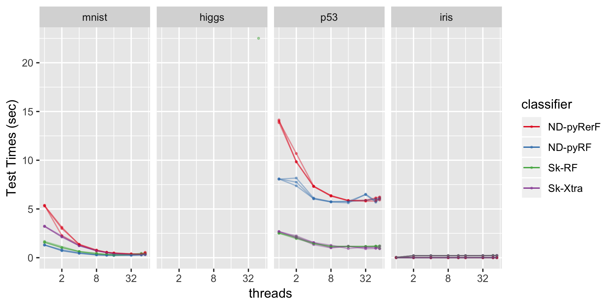
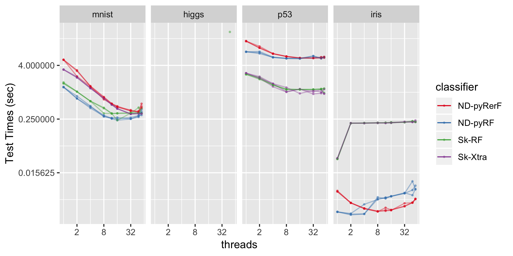

`Download the code
here <https://raw.githubusercontent.com/neurodata/RerF/staging/docs/demos/testing_times.py>`__

Testing Times on Iris, MNIST, HIGGS, and P53 datasets.
======================================================

The datasets used for this experiment were obtained from the following
links.

Iris: A standard machine learning dataset included in
-----------------------------------------------------

.. code:: python

   from sklearn import datasets
   iris = datasets.load_iris()

`MNIST <https://www.kaggle.com/oddrationale/mnist-in-csv>`__
------------------------------------------------------------

MNIST was used as given, 60k training points and 10k testing points.

`HIGGS <https://archive.ics.uci.edu/ml/datasets/HIGGS>`__
---------------------------------------------------------

The Higgs dataset was used as described on the UCI website. The first
10,500,000 rows were used for training and the remaining 500,000 for
testing.

`P53 <https://archive.ics.uci.edu/ml/datasets/p53+Mutants>`__
-------------------------------------------------------------

The p53 dataset required removal of rows containing “?”’s. The ``old``
data were used to train and the ``new`` were used to test.

.. code:: r

   require(ggplot2)

   d1 <- fread("outputCSVSyn1/testing_times_python_iris.csv")
   d2 <- fread("outputCSVSyn1/testing_times_python_mnist.csv")
   d3 <- fread("outputCSVSyn1/testing_times_python_p53.csv")
   d4 <- fread("outputCSV_MARCC/testing_times_MARCC_python_higgs.csv")

   d0 <- rbind(d1, d2, d3, d4)
   d0 <- d0[threads %in% c(1,2,4,8,12,16,32,48,56) & iterate <= 3, ]

   d0$classifier <- factor(d0$classifier)

   #dA <- rbind(d0, d0[, .(iterate = max(d0$iterate) + 1, 
   #                      Lhat = mean(Lhat),
   #                      trainTime = mean(trainTime), 
   #                      testTime = mean(testTime)), by = .(classifier, threads, dataset)])

   dA <- d0

   dA$dataset <- factor(dA$dataset, levels = c("mnist","higgs", "p53", "iris"))
   dA$algorithm <- factor(c("RerF", "RF", "RF", "Xtra")[as.numeric(dA$classifier)])
   dA$developer <- factor(c("NeuroData", "NeuroData", "SKL", "SKL")[as.numeric(dA$classifier)])

   ## to show means
   #dA$panel <- factor(dA$iterate == 4, labels = c("iterates", "means"))

   lineSize <- c(rep(0.5,3), 1)
   lineAlpha <- c(rep(0.4, 3), 0.2)

   ex <- scale_colour_brewer(type = 'qual', palette = "Set1")

   p01 <- ggplot(data = dA, aes(x = threads, y = testTime, 
                               group = interaction(classifier, iterate, dataset), color = classifier)) +
           geom_point(alpha = 0.4, size = 0.5) + 
           geom_line(alpha = lineAlpha[dA$iterate], size = lineSize[dA$iterate]) + ex 

   p01 <- p01 + facet_grid(. ~ dataset) + scale_x_continuous(trans = scales::log2_trans()) 

   p1 <- p01 + scale_y_continuous(trans = scales::log2_trans())

   png(file = "testTimes01.png", w = 2*1080, h = 1080, res = 300)
   show(p01 + ylab("Test Times (sec)"))
   dev.off()

   png(file = "testTimes02.png", w = 2*1080, h = 1080, res = 300)
   show(p1 + ylab("Test Times (sec)"))
   dev.off()

|image0|\ 

|image1|\ 

